# Claude Statusline (Catppuccin Powerline)

A four-line Catppuccin Powerline statusline for Claude Code: directory + git
branch + pull request, active skills, model + effort, and real token/rate-limit
usage (context window, 5-hour window, 7-day window) with reset countdowns.
Also shows `rtk` token-savings, when `rtk` is installed.

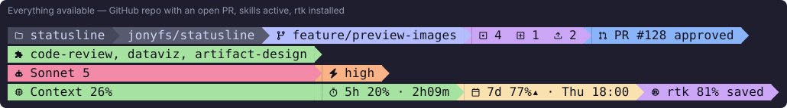

Every image in this README is generated by `npm run previews`, which runs the
actual renderer and converts its real ANSI output to SVG — they are not
mockups, so they can't drift from what the code does.

## What it looks like in each situation

Not every session has a pull request, a git repo, or active skills. Segments
that have no data are omitted rather than shown empty, so the line stays
short when there's little to say.

**On a branch with no open pull request** — the PR segment simply isn't there:

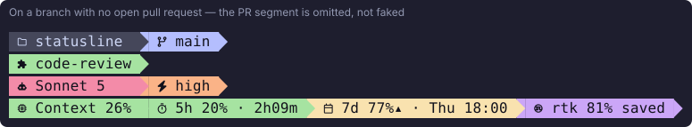

**Ahead of and behind upstream, with a draft PR:**

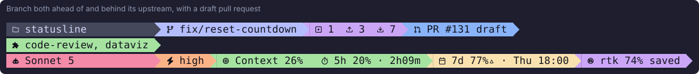

**Outside a git repository** — line 1 keeps the directory and drops the rest:

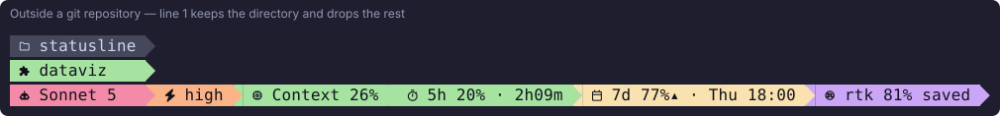

**Nothing but a session** — no git, no skills, no rtk. The skills line
disappears entirely, leaving three lines instead of four:

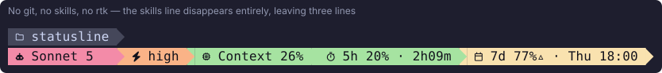

**Close to the weekly limit** — the numbers are read from Claude Code, so a
nearly-exhausted window shows as one:

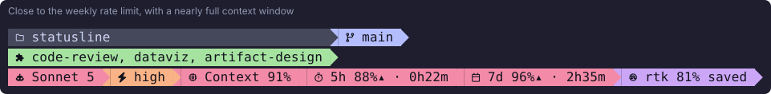

**Older Claude Code that doesn't send rate-limit fields** — unknown values
show `?%` and `reset time unknown`. Nothing is estimated to fill the gap:

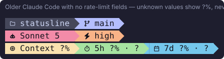

## Themes

All four Catppuccin flavors are supported via `CLAUDE_STATUSLINE_FLAVOR`:

| Flavor | Preview |
|---|---|
| `mocha` (default) | 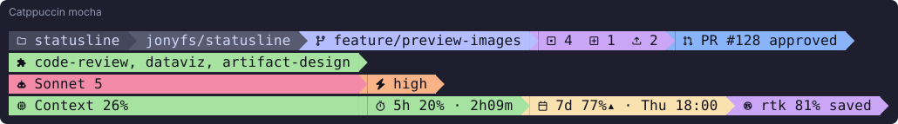 |
| `frappe` | 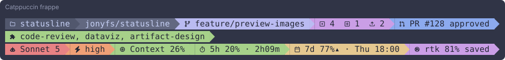 |
| `macchiato` | 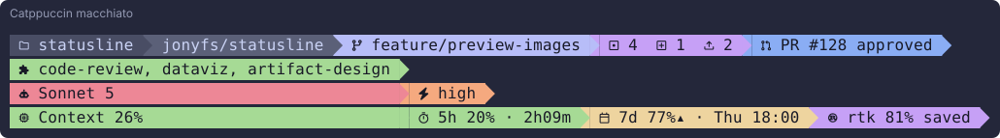 |
| `latte` | 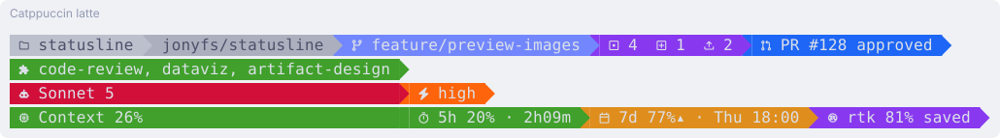 |

If your terminal has no Nerd Font, `CLAUDE_STATUSLINE_ASCII=1` swaps the
Powerline separator for a plain arrow:

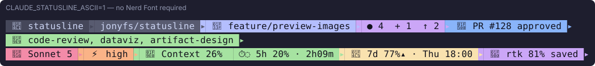

## How auto-update works

No daemon, no polling loop. Claude Code invokes the configured `statusLine`
command itself every time it re-renders the status bar, piping fresh session
JSON into the command's stdin — including exact context-window and rate-limit
percentages. This script reads that JSON, gathers a few more things (git, gh,
the session transcript, rtk) and prints the four lines — so it is always
current as of the last render tick without you doing anything.

## Install (local)

```bash
cd statusline
npm link
statusline-plugin install
```

This will:
- back up your current `~/.claude/settings.json` to
  `~/.claude/statusline/backups/settings.<timestamp>.json`
- add/replace the `statusLine` key so Claude Code calls this plugin
- leave every other setting untouched

Restart Claude Code (or start a new session) to see it.

## Uninstall

```bash
statusline-plugin uninstall
```

Removes the `statusLine` key only if it points at this plugin's `cli.js`.
Backups made on install are never deleted automatically.

## Configuration

Environment variables (set in your shell profile, or inline in the
`statusLine.command` string written to `settings.json`):

- `CLAUDE_STATUSLINE_FLAVOR` — `mocha` (default) | `frappe` | `macchiato` | `latte`
- `CLAUDE_STATUSLINE_ASCII=1` — disables the Powerline arrow separator for
  terminals without a Nerd Font installed
- `CLAUDE_STATUSLINE_DEBUG=1` — writes the raw stdin payload Claude Code
  sent to `~/.claude/statusline/debug-last-payload.json` on every render,
  for troubleshooting if a field's shape changes in a future Claude Code
  version

## Where each number comes from

- **Context %, 5-hour %, 7-day %, both reset countdowns** — read directly
  from Claude Code's own `context_window` and `rate_limits` stdin fields.
  Not estimated. There is no monthly figure: Anthropic's plan limits stop
  at a 7-day window, and this plugin doesn't invent a number to fill a
  slot Anthropic doesn't provide.
- **rtk savings %** — `rtk gain --format json`, only when `rtk` is
  installed; the segment is omitted otherwise.
- **Pull request info** — the `gh` CLI, authenticated, in a GitHub repo
  with an open PR for the current branch. Omitted if any of that is
  missing.
- **Active skills** — scanned from the current session's transcript for
  `Skill` tool calls. If Claude Code's transcript format changes, this
  degrades to showing no skills rather than crashing.

## Where each icon comes from

- **Branch** and **reset clock** — copied verbatim from this machine's own
  `~/.config/starship.toml` (`git_branch` and `time` module symbols):
  `U+F418` (`nf-oct-git_branch`, GitHub's own branch icon) and `U+F43A`
  (`nf-oct-clock`). Proven to render in the Nerd Font that config already
  uses, rather than a guessed private-use codepoint.
- **Pull request** — `U+F407` (`nf-oct-git_pull_request`), from the same
  Octicons set, verified present in the installed Nerd Font by reading
  the font's `cmap` table.
- **Everything else** (directory, skills, model, effort, context,
  rate-limit windows, rtk) — color emoji, which need no special font.

## Regenerating the previews

```bash
npm run previews
```

Renders every scenario in `scripts/preview-fixtures.js` through the real
`renderPayload()` and writes `docs/previews/*.svg`. Inputs are fixed and
the clock is frozen during generation, so running it without a code change
produces no diff. Nerd Font glyphs are embedded as extracted outlines
(`src/preview/glyphs.json`), so the SVGs render correctly for viewers with
no Nerd Font installed — GitHub's README renderer included.

Regenerating `glyphs.json` is only needed if a new Nerd Font glyph is
introduced, and requires `fonttools`:

```bash
python3 -m venv /tmp/statusline-venv
/tmp/statusline-venv/bin/pip install fonttools brotli
/tmp/statusline-venv/bin/python scripts/extract-glyphs.py > src/preview/glyphs.json
```

## Troubleshooting

- **Icons show as boxes/question marks**: your terminal font isn't a Nerd
  Font, or doesn't support color emoji. Install one (e.g. MesloLGS NF,
  FiraCode Nerd Font) or set `CLAUDE_STATUSLINE_ASCII=1`.
- **Nothing changed after install**: restart your Claude Code session —
  `settings.json` is read at startup.
- **A percentage shows `?%`**: Claude Code's payload didn't include that
  field this time (older client version, or a startup render before the
  session has any usage yet). See the "missing payload fields" preview
  above for exactly how that looks.
- **Clicking the directory doesn't open a new tab**: only iTerm2 and
  Terminal.app are supported; other terminals fall back to a Finder
  reveal. The first click may also trigger a one-time macOS Automation
  permission prompt for the terminal app.
- **Want the stock statusline back**: run `statusline-plugin uninstall`.

## Clickable names

The directory, branch, and PR segments on line 1 are OSC 8 terminal
hyperlinks — the visible text stays exactly what you see (no URL is ever
printed), but it's clickable in terminals that support OSC 8:

- **Directory** → on iTerm2 and Terminal.app, opens a new tab in that
  same app, `cd`'d into the directory (via a generated `.command`
  script and AppleScript). Any other terminal (Warp, VS Code's
  integrated terminal, kitty, WezTerm, ...) has no automation target
  from here, so it falls back to a plain `file://` link, which most
  terminals resolve to revealing the folder in Finder.
- **Branch** → the branch's tree view on GitHub (built from `git remote
  get-url origin`), only when a remote is configured.
- **PR** → the pull request's page on GitHub, only when one is open.

Terminals without OSC 8 support just show the plain text, unaffected.
